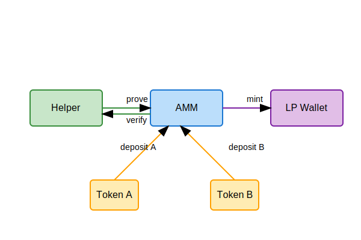

# SimpleAMM: Minimalistic AMM on Tolk

## Overview
SimpleAMM is a lightweight implementation of an Automated Market Maker (AMM) on TON blockchain. The project provides basic swapping functionality with a constant product formula (x*y=k) and standard liquidity provision mechanics.

## Key Features
- Constant product AMM (x*y=k)
- LP token minting/burning
- Two-token swaps with slippage protection
- Configurable swap fees
- Price impact calculation

## System Architecture

### Smart Contracts
1. **AMM Pool Contract**
   - Core AMM functionality
   - Handles swaps and liquidity management
   - Manages LP token minting and burning

2. **Deposit Helper Contract**
   - Facilitates liquidity provision
   - Ensures correct token ratio
   - Handles excess token returns

3. **LP Wallet Contract**
   - Standard TON Jetton wallet implementation
   - Manages LP token operations

## Technical Specifications

### Operations
1. **Liquidity Provision**
   - First provider sets the initial price
   - Subsequent providers must match the current ratio
   - LP tokens minted proportionally to contribution

2. **Swapping**
   - Constant product formula (x*y=k)
   - Configurable swap fee
   - Slippage protection
   - Price impact calculation

3. **Liquidity Removal**
   - Burns LP tokens
   - Returns underlying assets proportionally
   - Supports partial withdrawals